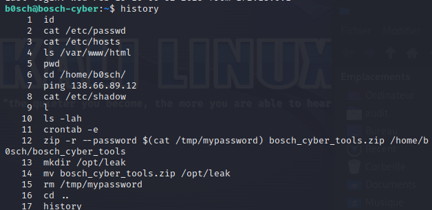

# Rapport d'analyse suite à l'attaque du site web bosch-cyber

## Préparation
L'environnement utilisé pour cette analyse forensique est constitué d'un machine virtuelle Kali Linux, sur laquelle tourne une image Docker du site web attaqué. Les accès à ce site se font par l'intermédiaire d'une connexion SSH sur le port 2222. L'identifiant et le mot de passe ont été fournis dans le cadre de cette analyse.

## Introduction
Le site bosch-cyber a été compromis et les attaquants ont potentiellement dérobé des données. Le site a été mis en maintenance afin de pouvoir analysé ce que l'attaquant a pu exfiltré, et les potentielles conséquences de cette attaque.

## Méthodologie
Différents points vont être abordés :
..* L'historique des commandes
..* L'analyse des logs
..* L'exploitation des données récupérés par les précédents points
..* L'analyse du crontab (planificateur de tâche)

##Résultats

###Vérification de l'historique
Dans un premier temps, voici l'historique des commandes lors de la connexion à la machine :

On y aperçoit plusieurs points intéressants:
1. Une connexion à une IP distante
2. Une utilisation du crontab
3. La création d'un zip, dont le mot de passe se situe dans le fichier "/tmp/mypasswd"
4. Le déplacement du zip dans le dossier "/opt/leak"
5. La suppression du fichier "/tmp/mypasswd" dans lequel se situe le mot de passe du zip

###Analyse des logs

Le serveur servant de site web, il est important de croiser les logs avec l'IP distante que nous avons récupérée grâce à la précédente commande. L'outil "grep" a permis d'identifier les requêtes générées par cette IP sur le site :

Parmi toutes les informations listées, il a été possible d'identifier clairement une utilisation frauduleuse de certaines requêtes, celles-ci sont ci-dessous :

Ceci nous a permis particulièrement d'identifier une ligne précisément qui indique la commande rentrant le mot de passe dans le fichier "/tmp/mypasswd"

Grâce au mot de passe récupéré, nous allons pouvoir exploiter le zip présent dans le dossier "/opt/leak"

###Exploitation des données
Une fois déplacé dans le dossier où se situe notre zip, le premier point est de vérifier le contenu de ce dernier, afin de s'assurer des types de format de fichier qui le compose :

On observe la présence d'un fichier "all_tools.txt". Un txt ne représentant pas de menace, nous allons dézipper l'archive dans un dossier dans lequel nous avons l'autorisation d'écrire. Dans la photo ci-dessous, l'utilisation d'unzip ayant déjà été réalisée, nous observons une demande de renommage du dossier d'arrivée. Le contenu du zip atterira donc directement dans le répertoire "/home/b0sch".

Nous pouvons maintenant lire le contenu du fichier texte :

###Analyse du crontab
Afin de vérifier si une potentielle persistance aurait été mise en place par l'attaquant sur le site web, nous allons vérifier le fichier crontab :

Le "job" est prévu pour s'éxécuter toutes les minutes, et ouvre un shell Bash en redirigeant la sortie vers un socket réseau sur l'adresse IP de l'attaquant, sur le port 4444, et renvoie toute l'entrée depuis le socket réseau vers le shell Bash. Pour traduire en quelques mots, c'est tout simplement une backdoor laissée par l'attaquant pour pouvoir continuer à manipuler à distance le serveur.

##Conclusions
Au vu des différents points relevés, nous pouvons identifier qu'une faille est présente sur le site web, et permet d'accéder aux fichiers internes du serveur, par l'intermédiaire de requêtes. Cela a permis à l'attaquant de rentrer sur le serveur, de déposer des données, tout en les sécurisant avec un mot de passe qui a été supprimé sur le serveur. Si les logs apache de ce serveur avaient été supprimés, il aurait été beaucoup plus ardu de retrouver le mot de passe permettant d'exploiter les données déposées. De plus une backdoor a été installée pour permettre à l'attaquant de conserver son emprise sur la machine.

##Recommandations
Afin de ne plus subir ce type d'attaque, il est recommandé de résoudre cete faille web permettant d'injecter du contenu sur la machine, mais également de protéger le traffic arrivant et sortant de ce serveur web. Le port 4444 n'étant pas commun, le bloquer permettrait d'empêcher l'utilisation de la backdoor.

##Conclusion générale
Cette attaque réalisée via l'interface web du serveur bosch-cyber consistait en la prise en main du serveur par l'intermédiaire d'une backdoor, et le dépot de données protégées par un mot de passe qui a été effacé sur le serveur.
Cette analyse a débutée le 15/02/2023 à 09h40 et s'est conclue par la rédaction du présent rapport ce 15/02/2023 à 12h45.

Réalisé par : Joé BIAVA
Signature : JB
